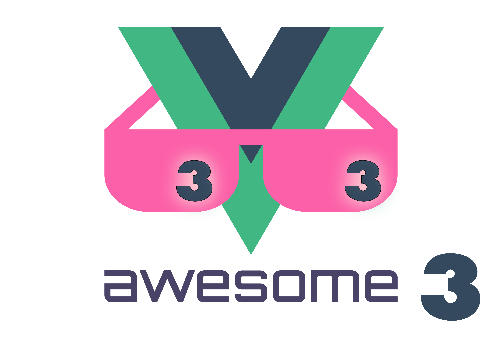

   
  
   
   

## Awesome Vue.js 3 

> A curated list of awesome things related to Vue.js 3

- [Resources](#resources)
  - [Official Resources](#official-resources)
  - [External Resources](#external-resources)
  - [Job Portal](#job-portal)
  - [Community](#community)
  - [Conferences](#conferences)
  - [Podcasts](#podcasts)
  - [Youtube Channels](#youtube-channels)
  - [Official Examples](#official-examples)
  - [Tutorials](#tutorials)
  - [Examples](#examples)
  - [Books](#books)
  - [Blog Posts](#blog-posts)
- [Projects Using Vue.js](#projects-using-vuejs)
  - [Open Source](#open-source)
  - [Commercial Products](#commercial-products)
  - [Apps/Websites](#appswebsites)
  - [Interactive Experiences](#interactive-experiences)
  - [Enterprise Usage](#enterprise-usage)
  - [A11y](#a11y)
- [Components & Libraries](#components--libraries)
  - [UI Components](#ui-components)
    - [Table](#table)
    - [Notification](#notification)
    - [Loader](#loader)
      - [Progress Bar](#progress-bar)
    - [Tooltip](#tooltip)
    - [Overlay](#overlay)
    - [Parallax](#parallax)
    - [Icons](#icons)
    - [Menu](#menu)

    - [Minus Plus Input](#minus-plus-input)
    - [Carousel](#carousel)
    - [Charts](#charts)
    - [Time](#time)
    - [Calendar](#calendar)
    - [Map](#map)
    - [Audio / Video](#audio--video)
    - [Infinite Scroll](#infinite-scroll)
    - [Pull-to-refresh](#pull-to-refresh)
    - [Markdown](#markdown)
    - [PDF](#pdf)
    - [Tree](#tree)
    - [Social Sharing](#social-sharing)
    - [QR Code](#qr-code)
    - [Search](#search)
    - [Miscellaneous](#miscellaneous)
    - [Tabs](#tabs)
    - [Form](#form)
      - [Phone Number Input](#phone-number-input-formatter)
      - [Picker](#picker)
      - [Generator](#generator)
        - [Date Picker](#date-picker)
      - [Select](#select)
      - [Slider](#slider)
      - [Drag and Drop](#drag-and-drop)
      - [Autocomplete](#autocomplete)
      - [Type Select](#type-select)
      - [Color Picker](#color-picker)
      - [Switch](#switch)
      - [Masked Input](#masked-input)
      - [Rich Text Editing](#rich-text-editing)
      - [Image Manipulation](#image-manipulation)
      - [Video Manipulation](#video-manipulation)
      - [File Upload](#file-upload)
      - [Context Menu](#context-menu)
      - [Miscellaneous](#miscellaneous-1)
      - [Wizard](#wizard)
      - [CSV](#csv)
      - [Comment System](#comment-system)
    - [Canvas](#canvas)
    - [Link Preview](#link-preview)
    - [Tour](#tour)
 

### Job Portal

- [Vue.js Jobs - VueJobs](https://vuejobs.com/) - A Vue.js job portal to hire or get hired for all your Vue.js jobs.
- [Vue.js Interview Questions](https://github.com/sudheerj/vuejs-interview-questions) - A List of 300 VueJS Interview Questions and Answers

### Community

- [Twitter](https://twitter.com/vuejs)
- [Official Forum](http://forum.vuejs.org/)
- [vue-requests](https://github.com/vuejs/vue-requests) - Request a Vue.js module you wish existed or get ideas for modules
- [VueJS Iran - Telegram Channel & group (group link available in channel bio)](https://telegram.me/vue_js)
- [vueslack - 2300+ registered users worldwide](https://vueslack.slack.com/)
- [Vue Land - Discord chat server](https://vue-land.js.org/)
- [VueJS Russia - Telegram Group [Russian]](https://t.me/vuejs_ru)
- [VueJS Viet Nam - Facebook group](https://www.facebook.com/groups/vuejsvietnam/)
- [VueJS Spanish - Slack Group](https://slack.vue-es.org/)
- [VueJS Korean - Slack Group](https://vuejs-korea.signup.team/)
- [VueJS Thailand - Facebook Group](https://www.facebook.com/groups/VuejsThailand/)
- [VueJS Brasil - Telegram Group [Portuguese]](https://t.me/vuejsbrasil)
- [VueJS Brasil - Facebook Page [Portuguese]](https://www.facebook.com/vuejsbrasil/)
- [VueJS Brasil - Facebook Group [Portuguese]](https://www.facebook.com/groups/vuejsbr/)
- [VueJS en español - Facebook Group [Spanish]](https://www.facebook.com/groups/vue.es/)
- [VueJS India 🇮🇳  - Discord chat server](https://goo.gl/mYXKUv)
- [VueJS Indonesia - Telegram Group [Indonesian]](https://t.me/vuejsid)
- [VueJS Hong Kong - Facebook group](https://www.facebook.com/groups/887185518120024)
- [VueJS Arab - Telegram Group](https://t.me/vuejsarab)
- [VueJS Vix - Telegram Group [Portuguese]](https://t.me/vuejsvix)
- [VueJS Vix - Meetup Page [Portuguese]](https://www.meetup.com/pt-BR/Vue-js-in-Vix/)
- [VueJS Norway - Meetup](https://www.meetup.com/VueJS-Oslo/)
- [VueJS Israel 🇮🇱 - Facebook Page](https://www.facebook.com/officalVuejsIsrael/)
- [VueJS Finland - Meetup](https://www.meetup.com/vuejs-finland/)
- [VueJS Finland - Facebook Page](https://www.facebook.com/vuejsfinland/)
- [Hablemos de Vue.js - Telegram Group [Castellano]](https://t.me/vuejsEs)

 
 
 

